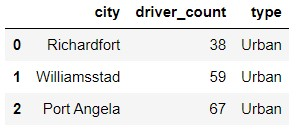
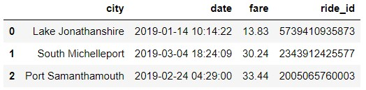
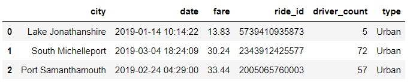
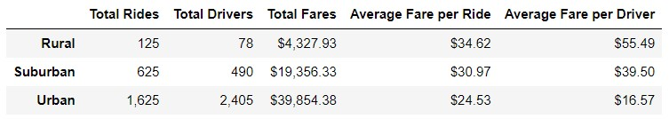
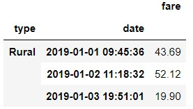
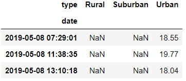
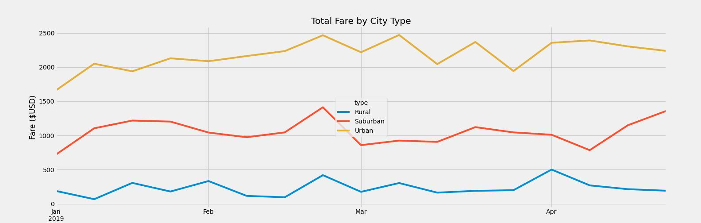

# PyBer-Analysis

## Overview

In this module, the *Python's Pandas* and *Python's Matplotlib* libraries are used to process, analyze and visualize PyBer's ride-sharing data.

Two input csv datasets are provided for its analysis:

1.Ride-sharing information by city, **[city data](./Resources/city_data.csv)**.

*Image 01: Input city data (sample rows).*

2.Ride-sharing information by ride, **[ride data](./Resources/ride_data.csv)**.

*Image 02: Input ride data (sample rows).*

The objectives are to showcase the relationship between the type of city and the number of drivers and riders as well as the percentage of total fares, riders and drivers for each type of city. The results being produced will help PyBer improve the acces to ride-sharing services and assess the affordability for underserved neighborhoods.

The **[analysis jupyter notebook](./PyBer_Challenge.ipynb)** along with the following three final deliverables are provided:

- **[Deliverable 1](./analysis/Deliverable1_SummaryDF.jpg)**: A ride-sharing summary DataFrame by city type.
- **[Deliverable 2](./analysis/Deliverable2_LineChart.jpg)**: A multiple-line chart of total fares for each city type.
- **Deliverable 3**: A written report for the PyBer analysis (This README.md file).

## Results

### **Deliverable 1: Ride-sharing summary DataFrame by city**

The first step to generate the ride-sharing summary dataframe consisted in merging the two input tables based on the name of the city, this is because the *city* column is the only one shared by both.  

*Image 03: Merged input data (sample rows).*

In order to create the summary table, first, the total number of rides and drivers per city type were calculated. Note that there are three city types, rural, suburban and urban and the total fare amount is also computed for all of them, this is, the sum of all the fares of each city. Finally, the average fare per ride & driver were calculated by dividing the total fare per city type over the total number of rides & drivers per city type respectively.

*Image 04: Deliverable 1: ride-sharing summary DataFrame by city type.*

A substantial reduction in the number of rides and drivers in the rural cities can be seen with respect to the suburban and to the urban cities. This is expected as the population is mostly concentrated in the urban regions. However, it is also observed that the average fare per ride and per driver is significantly reduced in the urban cities with respect to those suburban and rural. This reduction can be atrributed in one hand to an over population of drivers in the urban cities, close to 80.89% in comparison to a 16.48% of suburban drivers and to only a 2.62% or rural drivers. Additionally, while the urban cities concentrated a 68.42% of the total number of rides, 26.32% were suburban and 5.26% were rural.

### **Deliverable 2: Multiple-line chart of total fares for each city type**

To produce the second deliverable, the previously merged dataframe was grouped by city type and date, and its cells were filled with the corresponding sum of the fares.

*Image 05: Merged dataframe grouped by city type and date with sum of fares.*

The next step consisted in using the pivot function to convert the table so that the index is the *date*, each column is a city *type* and the values are the "fare" Note that empty cells were filled with NaN (not a number) values, to avoid performing future invalid calculations.

*Image 06: Pivot table.*

Since the analysis needed to be focused between January first and April 28th 2019, a date filter was applied to the input pivot table. We then proceeded to resampled the data in a weekly basis in order to simplify the visual inspection of the results.

Finally, a multiple-line chart containing the total fares for each coty type was produced.

*Image 07: Deliverable 2: Multiple-line chart of total fares for each city type.*

## Summary

s
